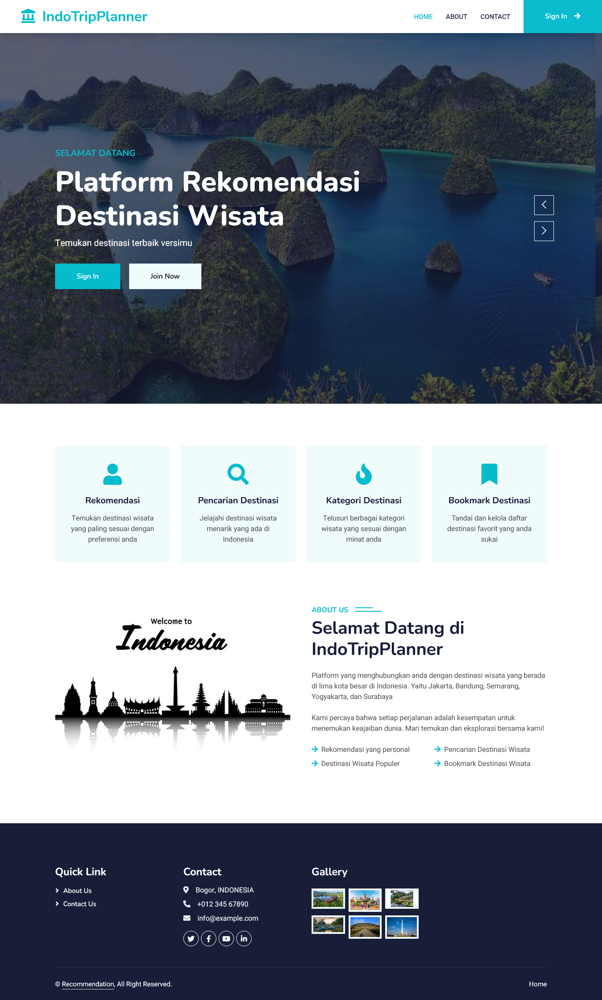

# INDOTRIPPLANNER


## Description
IndoTripPlanner is a web-based application that lets users explore tourist destinations across Indonesia, mark favorite places, and receive personalized recommendations based on their selected favorites.

## Tools & Technologies
- Python
- Flask
- HTML, CSS, JavaScript
- MySQL (XAMPP)
- Pandas
- scikit-learn (TF-IDF & cosine similarity for recommendations)
- Bootstrap (optional)

## Features
- Browse a list of tourist destinations in Indonesia
- Add destinations to your personal favorites list
- Personalized recommendations based on favorites
- Search destinations
- User authentication & session handling

## Installation
1. clone the project
   ```sh
   git clone https://github.com/nur-fauziyah/indotripplanner.git
   cd indotripplanner
   ```
2. Import Database
   - Open **phpMyAdmin**
   - Click **Import**
   - Select the SQL file located in:
     ```sh
     database/db_wisata.sql
     ```
3. Create and activate a virtual environment
   ```sh
   python -m venv venv
   ```
   - Activate virtual environment for **Linux / MacOS**
     ```sh
     source venv/bin/activate
     ```
   - Activate virtual environment for **Windows**
     ```sh
     venv\Scripts\activate
     ```

4. Install required dependencies
   ```sh
   pip install -r requirements.txt
   ```
     
5. Run the Flask application
   ```sh
   flask run
   ```
   Open in browser
   ```sh
   http://localhost:5000/
   ```
